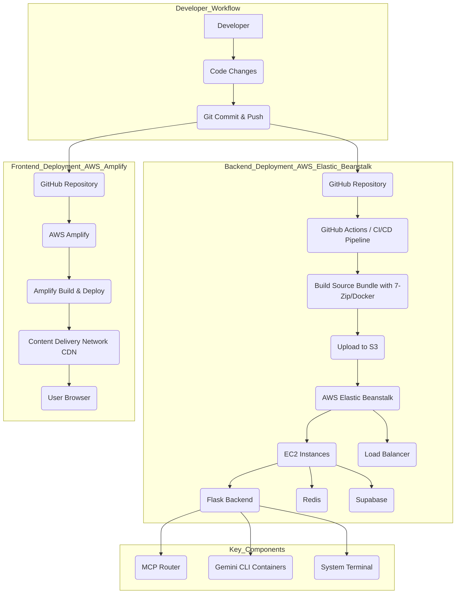

# TubbyAI Deployment Instructions

## 1. Introduction
This document outlines a systematic approach to deploying the TubbyAI platform, addressing the critical Elastic Beanstalk deployment issues and leveraging AWS CLI EB for the backend and GitHub with Amplify for the frontend. The primary goal is to ensure a robust, repeatable, and efficient deployment process for both development and production environments.

## 2. Backend Deployment Strategy (AWS Elastic Beanstalk)

### 2.1 Understanding the Problem
The core issue identified is the incompatibility of ZIP files created on Windows environments (specifically using PowerShell's `Compress-Archive`) with Linux-based AWS Elastic Beanstalk environments. These ZIP files contain Windows-style path separators (backslashes `\`), which the Linux `unzip` utility fails to process, leading to deployment failures.

### 2.2 Recommended Solution: 7-Zip for Source Bundling
The immediate and most effective solution is to use 7-Zip for creating the source bundles. 7-Zip correctly generates Unix-compatible ZIP files with forward slashes (`/`) as path separators, resolving the `unzip` errors on Elastic Beanstalk.

#### 2.2.1 Prerequisites
1. **Install 7-Zip:** Ensure 7-Zip is installed on all Windows development machines. It can be downloaded from [https://7-zip.org/](https://7-zip.org/).
2. **AWS CLI:** Ensure AWS CLI is installed and configured with appropriate credentials and permissions to deploy to Elastic Beanstalk.
3. **Elastic Beanstalk CLI (EB CLI):** Install and configure the EB CLI. This tool simplifies the management and deployment of applications to Elastic Beanstalk.

#### 2.2.2 Step-by-Step Backend Deployment using 7-Zip and EB CLI

1.  **Navigate to the Backend Directory:**
    Open your terminal or command prompt and navigate to the root directory of your backend application (e.g., `cd path/to/your/tubby/backend`).

2.  **Clean and Prepare the Environment (Optional but Recommended):**
    Ensure your environment is clean before creating the source bundle. This might involve removing temporary files, build artifacts, or virtual environment directories (e.g., `venv`, `__pycache__`).

3.  **Create the Unix-Compatible Source Bundle using 7-Zip:**
    Instead of `Compress-Archive`, use 7-Zip to create the `.zip` file. A PowerShell script `scripts/create_unix_zip_with_7zip.ps1` is provided in the repository for this purpose. Execute it from your backend root directory:
    ```powershell
    # Assuming you are in the 'tubby' root directory
    # Navigate to the backend directory first
    Set-Location -Path backend
    # Then execute the script from the 'scripts' directory
    ..\scripts\create_unix_zip_with_7zip.ps1
    # This script will create 'app.zip' in the current directory (backend)
    ```
    *Note: This script should be reviewed to ensure it correctly includes all necessary files and excludes unnecessary ones (e.g., `.git`, `node_modules` if any, `venv`).*

4.  **Deploy using EB CLI:**
    Once `app.zip` is created in your backend directory, you can deploy it using the EB CLI. Ensure you are still in the backend directory.
    ```bash
    eb deploy
    ```
    The EB CLI will automatically detect the `app.zip` file and upload it to your Elastic Beanstalk environment. If you have multiple environments, you might need to specify the environment name:
    ```bash
    eb deploy your-environment-name
    ```

5.  **Monitor Deployment:**
    Monitor the deployment status using the EB CLI:
    ```bash
    eb status
    eb events
    eb logs
    ```
    Check `eb events` and `eb logs` (especially `eb-engine.log`) for any issues during deployment. A successful deployment will show `Environment health: Green`.

### 2.3 Alternative Backend Deployment Methods

#### 2.3.1 Docker-based Deployment
For a more robust and cross-platform solution, Docker can be used to create the deployment package. This method ensures that the ZIP file is created within a Linux environment, inherently resolving the path separator issue.

1.  **Prerequisites:** Docker Desktop installed.
2.  **Script:** Use `scripts/create_docker_zip.ps1` (or a similar script) to build a Docker image, copy the application files into it, and then create a ZIP file from within the container.
3.  **Deployment:** Deploy the generated ZIP file using `eb deploy` as described above.

#### 2.3.2 Git-based Deployment
Elastic Beanstalk supports direct deployment from a Git repository. This method bypasses the need for manual ZIP creation entirely.

1.  **Prerequisites:** Your application code must be in a Git repository accessible by Elastic Beanstalk (e.g., AWS CodeCommit, GitHub).
2.  **Configuration:** Configure your Elastic Beanstalk environment to pull directly from your Git repository.
3.  **Deployment:** Push changes to your Git repository, and Elastic Beanstalk will automatically deploy the new version.

### 2.4 Systematic Approach to Backend Deployment Issues

1.  **Standardize Source Bundling:** Enforce the use of 7-Zip or Docker-based ZIP creation for all Windows developers to prevent path separator issues.
2.  **Automate with CI/CD:** Implement a CI/CD pipeline (e.g., using GitHub Actions, AWS CodePipeline) that builds the source bundle in a Linux environment (e.g., Docker container) and then deploys to Elastic Beanstalk. This eliminates manual errors and ensures consistency.
3.  **Pre-deployment Validation:** Integrate checks within the CI/CD pipeline to validate the integrity and compatibility of the source bundle before deployment.
4.  **Comprehensive Logging and Monitoring:** Ensure detailed logging is enabled on Elastic Beanstalk and integrate with monitoring tools (e.g., AWS CloudWatch) to quickly identify and diagnose deployment failures.
5.  **Regular Training and Documentation:** Provide ongoing training to developers on the standardized deployment procedures and maintain up-to-date documentation.

## 3. Frontend Deployment Strategy (GitHub and AWS Amplify)

### 3.1 Overview
AWS Amplify provides a fast and scalable way to deploy single-page applications (SPAs) and static websites. Given the `AMPLIFY_DEPLOYMENT_GUIDE.md` in the repository, it is the intended solution for the React-based frontend.

### 3.2 Step-by-Step Frontend Deployment using GitHub and Amplify

1.  **Connect Repository to Amplify:**
    In the AWS Amplify Console, create a new app and connect it to your GitHub repository. Select the branch you want to deploy (e.g., `main` or `develop`).

2.  **Configure Build Settings:**
    Amplify will automatically detect your frontend framework (React) and suggest build settings. Verify and adjust if necessary. A typical `amplify.yml` for a React app might look like this:
    ```yaml
    version: 1
    frontend:
      phases:
        preBuild:
          commands:
            - npm ci
        build:
          commands:
            - npm run build
      artifacts:
        baseDirectory: build
        files:
          - '**/*'
      cache:
        paths:
          - node_modules/**/
    ```

3.  **Deploy:**
    Once configured, Amplify will automatically build and deploy your frontend whenever changes are pushed to the connected branch. You can also manually trigger deployments from the Amplify Console.

4.  **Monitor Deployment:**
    Monitor the build and deployment status in the Amplify Console. It provides detailed logs for each stage (Provision, Build, Deploy, Verify).

### 3.3 Systematic Approach to Frontend Deployment

1.  **Branching Strategy:** Implement a clear branching strategy (e.g., Git Flow or GitHub Flow) to manage releases and features, ensuring that only stable code is deployed to production via Amplify.
2.  **Automated Testing:** Integrate unit, integration, and end-to-end tests into your frontend development workflow. Ensure these tests run as part of your CI/CD pipeline (e.g., via GitHub Actions) before deployment to Amplify.
3.  **Environment Variables:** Manage environment-specific configurations (e.g., API endpoints) using Amplify's environment variables feature. This allows you to easily switch configurations between development, staging, and production environments.
4.  **Performance Monitoring:** Integrate frontend performance monitoring tools to track and optimize the user experience after deployment.

## 4. Conclusion
By adopting these systematic approaches for both backend and frontend deployments, TubbyAI can overcome its current deployment challenges, streamline its development workflow, and ensure reliable delivery of its platform.


## 5. Deployment Flow Diagram




