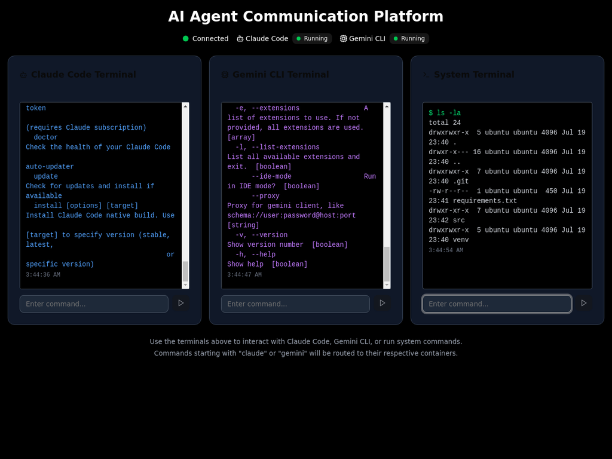

# 🧠 Tubby AI - Intelligent Agent Communication Platform

[](https://opensource.org/licenses/MIT)
[](https://www.python.org/)
[](https://reactjs.org/)
[](https://www.docker.com/)
[](https://modelcontextprotocol.io/)
[](https://supabase.com/)

A revolutionary web-based platform that enables seamless communication between AI agents (Claude Code, Gemini CLI) and system terminals through **Model Context Protocol (MCP)**. Experience real-time inter-terminal communication, collaborative AI workflows, and powerful command routing capabilities with secure authentication.

**🌟 Star this repository if you find it useful!**



## ✨ Features

- **🔐 Secure Authentication**: Google OAuth and GitHub login integration with Supabase
- **🔗 MCP Inter-Terminal Communication**: Real-time messaging, command routing, and collaboration between terminals
- **🤖 Multi-Agent Interface**: Claude Code, Gemini CLI, and System terminals with intelligent routing
- **⚡ Real-time Communication**: WebSocket-based command execution with instant feedback
- **📊 Live Container Monitoring**: Real-time status indicators for all containers
- **🎨 Modern Dark UI**: Beautiful, responsive interface with drag-and-drop terminals
- **🐳 Docker Integration**: Containerized AI agents for easy deployment and scaling
- **🔒 Secure API Management**: Environment-based API key management with encryption
- **📱 Responsive Design**: Works seamlessly on desktop and mobile devices
- **🔧 Advanced Features**: Voice input, screenshots, copy/paste, and command history
- **💳 Subscription Management**: Stripe integration for subscription plans
- **👤 User Profiles**: Personalized experience with user-specific settings and data

## 🏗️ Architecture

The application consists of:

- **Frontend** (Port 3003): React-based web interface with real-time updates and authentication
- **Backend** (Port 5001): Flask backend with WebSocket support, MCP routing, and OAuth integration
- **MCP Router** (Port 8080): Model Context Protocol router for inter-agent communication
- **Gemini CLI Container 1** (Port 8001): Primary Gemini CLI instance
- **Gemini CLI Container 2** (Port 8002): Secondary Gemini CLI instance for collaboration
- **System Terminal** (Port 5001): Local system command execution
- **Redis** (Port 6379): Session management, caching, and shared data storage
- **Supabase**: Authentication, user management, and database services

## 🚀 Quick Start

### Prerequisites

1. **Docker and Docker Compose** installed on your system
2. **Supabase Account** for authentication and database services
3. **API Keys** for the AI services (optional for basic functionality)

### Installation

1. **Clone the repository**
   ```bash
   git clone https://github.com/sentilabs01/tubby.git
   cd tubby
   ```

2. **Set up Environment Variables**
   ```bash
   cp .env.example .env
   ```
   
   Edit `.env` and add your configuration:
   ```env
   # Flask Configuration
   SECRET_KEY=your-secret-key-change-in-production
   FLASK_ENV=development
   
   # Supabase Configuration
   SUPABASE_URL=your-supabase-project-url
   SUPABASE_ANON_KEY=your-supabase-anon-key
   
   # OAuth Configuration
   GOOGLE_CLIENT_ID=your-google-client-id
   GOOGLE_CLIENT_SECRET=your-google-client-secret
   GOOGLE_REDIRECT_URI=http://localhost:5001/auth/google/callback
   
   # JWT Configuration
   JWT_SECRET_KEY=your-jwt-secret-key
   JWT_ALGORITHM=HS256
   JWT_EXPIRATION_HOURS=24
   
   # Frontend URL
   FRONTEND_URL=http://localhost:3003
   
   # API Keys (Optional)
   ANTHROPIC_API_KEY=your-anthropic-api-key
   GOOGLE_API_KEY=your-google-api-key
   OPENAI_API_KEY=your-openai-api-key
   
   # Stripe Configuration (Optional)
   STRIPE_PUBLISHABLE_KEY=your-stripe-publishable-key
   STRIPE_SECRET_KEY=your-stripe-secret-key
   STRIPE_WEBHOOK_SECRET=your-stripe-webhook-secret
   ```

3. **Configure Supabase Authentication**
   
   Follow the detailed setup guide in `AUTH_SETUP_GUIDE.md` to configure:
   - Google OAuth provider
   - GitHub OAuth provider
   - Database schema setup
   - Stripe integration (optional)

4. **Run the Application**
   ```bash
   docker-compose up --build
   ```

5. **Access the Web Interface**
   
   Open your browser and navigate to: **http://localhost:3003**

## 🔐 Authentication

Tubby AI supports multiple authentication methods:

### **Google OAuth**
- Secure sign-in with Google accounts
- Automatic user profile creation
- Email verification and profile data sync

### **GitHub OAuth**
- Developer-friendly GitHub integration
- Access to GitHub profile information
- Seamless developer experience

### **Guest Mode**
- Quick access without account creation
- Session-based temporary access
- Perfect for testing and demos

### **User Management**
- Personalized API key storage
- User-specific settings and preferences
- Subscription management with Stripe
- Secure session management with JWT tokens

## 🎯 Usage

### **🔐 Getting Started with Authentication**

1. **Sign In**: Choose your preferred authentication method
   - Click "Sign in with Google" for Google OAuth
   - Click "Sign in with GitHub" for GitHub OAuth
   - Click "Continue as Guest" for temporary access

2. **API Key Setup**: Configure your AI service API keys
   - Navigate to Settings Panel
   - Add your Anthropic, Google, or OpenAI API keys
   - Keys are encrypted and stored securely

3. **Start Collaborating**: Begin using the MCP communication features

### 🔗 MCP Inter-Terminal Communication

Tubby's most powerful feature is the ability for terminals to communicate with each other using the Model Context Protocol (MCP). Here are the key communication patterns:

#### **📤 Direct Messaging**
Send messages between terminals in real-time:
```bash
# Send message from Terminal 1 to Terminal 2
@terminal2 Hello from Gemini Terminal 1!

# Send message from Terminal 2 to System Terminal
@terminal3 Can you help me with a system command?

# Send message from System Terminal to Terminal 1
@terminal1 I'm ready to help with system tasks!
```

#### **🔄 Command Routing**
Route commands to specific terminals:
```bash
# Route system command from Terminal 1 to System Terminal
>>terminal3 dir

# Route Gemini command from Terminal 2 to Terminal 1
>>terminal1 gemini --help

# Route AI prompt from System Terminal to Terminal 2
>>terminal2 gemini --prompt "What is AI?"
```

#### **🔧 MCP Function Calls**
Use built-in MCP functions for advanced features:
```bash
# Broadcast message to all terminals
mcp broadcast "Important: System maintenance in 5 minutes"

# Share data between terminals
mcp set_shared_data {"project": "tubby", "status": "active"}

# Retrieve shared data
mcp get_shared_data
```

#### **🤝 Collaboration Requests**
Request help or collaboration from other terminals:
```bash
# Request collaboration from Terminal 2
collab terminal2 "Can you help me write a Python function?"

# Request system help
collab terminal3 "I need to check disk space usage"

# Request AI assistance
collab terminal1 "Help me understand machine learning concepts"
```

### Terminal Commands

1. **Gemini CLI Terminal 1**: Primary AI assistance
   ```bash
   gemini --help
   gemini --prompt "Write a Python function"
   gemini --prompt "Hello, can you help me?"
   ```

2. **Gemini CLI Terminal 2**: Secondary AI collaboration
   ```bash
   gemini --prompt "Explain quantum computing"
   gemini --prompt "What is the Model Context Protocol?"
   ```

3. **System Terminal**: Execute system commands
   ```bash
   dir
   pwd
   whoami
   echo "Hello World"
   ```

### 🎨 Advanced UI Features

- **🖱️ Drag & Drop**: Click and drag terminal headers to reposition them
- **📏 Resize**: Drag the bottom-right corner to resize terminals
- **⬆️ Command History**: Use ↑/↓ arrow keys to navigate command history
- **📋 Copy/Paste**: Use Ctrl+C/Ctrl+V or click the clipboard buttons
- **📸 Screenshots**: Click the camera button to save terminal as image
- **🎤 Voice Input**: Click the microphone button for voice commands
- **🔄 Real-time Updates**: Live status indicators and instant feedback
- **👤 User Profile**: Access your profile, settings, and subscription status

### Container Status Indicators

The web interface shows real-time status indicators:
- 🟢 **Green**: Container is running and healthy
- 🔴 **Red**: Container is stopped or unhealthy
- 🟡 **Yellow**: Status unknown
- 📡 **Connected**: WebSocket connection status

## 🛠️ Development

### Project Structure
```
tubby/
├── App.jsx                 # Main React application with MCP communication
├── backend/                # Flask backend with WebSocket and MCP support
│   ├── app.py             # Main Flask application with OAuth and MCP routing
│   ├── requirements.txt   # Python dependencies
│   ├── supabase_client.py # Database integration
│   └── services/          # Authentication and business logic services
│       ├── oauth_service.py    # OAuth integration (Google, GitHub)
│       ├── user_service.py     # User management
│       └── stripe_service.py   # Payment processing
├── src/                   # React source files
│   ├── components/        # React components
│   │   ├── AuthManager.jsx    # Authentication context and logic
│   │   ├── Login.jsx          # Login interface
│   │   ├── UserProfile.jsx    # User profile management
│   │   └── SubscriptionPlans.jsx # Subscription management
│   ├── main.jsx          # React entry point
│   └── index.css         # Global styles
├── components/            # React UI components
│   ├── ui/               # Reusable UI components (buttons, inputs, etc.)
│   └── SettingsPanel.jsx # Settings and configuration panel
├── containers/           # Docker container configurations
│   ├── gemini-cli/       # Gemini CLI containers
│   ├── mcp-router/       # MCP router for inter-agent communication
│   └── claude-code/      # Claude Code container (legacy)
├── utils/                # Utility functions
│   └── smartParser.js    # MCP command parsing and routing
├── database/             # Database schema and setup
│   ├── schema.sql        # Supabase database schema
│   └── README.md         # Database setup instructions
├── docker-compose.yml    # Docker Compose configuration
├── package.json          # Node.js dependencies
├── vite.config.js        # Vite build configuration
├── AUTH_SETUP_GUIDE.md   # Authentication setup instructions
└── mcp_test_commands.md  # MCP communication examples
```

### Making Changes

1. **Frontend**: Edit `App.jsx` and files in the `src/components/` directory
2. **Backend**: Edit files in the `backend/` directory
3. **Authentication**: Modify `backend/services/oauth_service.py` for OAuth changes
4. **MCP Logic**: Edit `utils/smartParser.js` for communication patterns
5. **Containers**: Edit files in `containers/gemini-cli/` and `containers/mcp-router/`

For development, you can run the frontend and backend separately:

```bash
# Terminal 1: Start backend
python backend/app.py

# Terminal 2: Start frontend
npm run dev
```

Or use Docker for full deployment:
```bash
docker-compose down
docker-compose up --build
```

## 🧪 Testing

### Authentication Testing

Test the authentication flow:
```bash
# Test Google OAuth
curl http://localhost:5001/auth/google

# Test GitHub OAuth
curl http://localhost:5001/auth/github

# Test guest authentication
curl http://localhost:5001/auth/guest

# Test user endpoint (requires authentication)
curl http://localhost:5001/auth/user
```

### Quick MCP Communication Tests

Try these commands to test the inter-terminal communication:

```bash
# Test messaging
@terminal2 Hello from Terminal 1!

# Test command routing
>>terminal3 dir

# Test MCP functions
mcp broadcast "Testing broadcast functionality"

# Test collaboration
collab terminal1 "Help me with AI tasks"
```

### Comprehensive Testing

For detailed testing scenarios, see `mcp_test_commands.md` which contains:
- Complete test workflows
- Multi-terminal collaboration examples
- Advanced MCP function usage
- Troubleshooting guides

### Connection Testing

To verify all services are running:
```bash
# Check backend
curl http://localhost:5001/health

# Check Gemini containers
curl http://localhost:8001/health
curl http://localhost:8002/health

# Check MCP router
curl http://localhost:8080/health

# Check authentication
curl http://localhost:5001/auth/user
```

## 🔧 Troubleshooting

### Common Issues

**Authentication Issues**
```bash
# Check OAuth configuration
curl http://localhost:5001/debug/supabase

# Verify environment variables
echo $SUPABASE_URL
echo $GOOGLE_CLIENT_ID
```

**Containers not starting**
```bash
# Check container logs
docker logs tubby-mcp-router-1
docker logs runmvpwithdockerandrequiredtools-gemini-cli-container-1-1
docker logs runmvpwithdockerandrequiredtools-gemini-cli-container-2-1
```

**Port conflicts**
If ports 3003, 5001, 8001, 8002, 8080, or 6379 are in use, modify the `docker-compose.yml` file to use different ports.

**Communication Timeout Issues**
If you see "Container communication error: Read timed out":
1. The containers have built-in timeout protection (45 seconds for CLI commands)
2. Complex AI commands may take longer to process
3. Try simpler commands first (e.g., `--help`, `--version`)
4. Check if the containers are healthy: `docker ps`

**API Key Issues**
If you don't have API keys, the containers will still run but CLI functionality may be limited.

**OAuth Configuration Issues**
- Ensure Google OAuth credentials are properly configured
- Verify GitHub OAuth app settings
- Check Supabase project configuration
- Review the `AUTH_SETUP_GUIDE.md` for detailed setup instructions

## 🛑 Stopping the Application

```bash
docker-compose down
```

To remove all data (including Redis data):
```bash
docker-compose down -v
```

## 📝 License

This project is open source and available under the [MIT License](LICENSE).

## 🤝 Contributing

1. Fork the repository
2. Create a feature branch (`git checkout -b feature/amazing-feature`)
3. Commit your changes (`git commit -m 'Add some amazing feature'`)
4. Push to the branch (`git push origin feature/amazing-feature`)
5. Open a Pull Request

## 📞 Support

If you encounter any issues or have questions:
1. Check the [troubleshooting section](#troubleshooting)
2. Review the [GitHub issues](https://github.com/sentilabs01/tubby/issues)
3. Create a new issue with detailed information

## 🔮 Roadmap

- [x] **MCP Inter-Terminal Communication** - ✅ Complete
- [x] **Real-time WebSocket Communication** - ✅ Complete
- [x] **Multi-Agent Support** - ✅ Complete
- [x] **Modern React UI** - ✅ Complete
- [x] **User Authentication & Multi-user Support** - ✅ Complete
- [x] **Google OAuth Integration** - ✅ Complete
- [x] **GitHub OAuth Integration** - ✅ Complete
- [x] **Supabase Database Integration** - ✅ Complete
- [ ] **Persistent Conversation Storage**
- [ ] **Advanced MCP Function Library**
- [ ] **Plugin System for Custom Integrations**
- [ ] **Mobile App Development**
- [ ] **Advanced Analytics & Monitoring**
- [ ] **Voice-to-Voice Communication Between Agents**
- [ ] **AI Agent Marketplace Integration**

## 🎬 Demo & Examples

### **Authentication Workflow**

1. **Sign In**: Choose Google, GitHub, or Guest authentication
2. **Profile Setup**: Configure your API keys and preferences
3. **Start Collaborating**: Begin using MCP communication features

### **Multi-Terminal Collaboration Workflow**

1. **Terminal 1**: `@terminal2 Starting our AI project collaboration`
2. **Terminal 2**: `@terminal1 Ready! What should we build?`
3. **Terminal 1**: `gemini --prompt "Create a Python web server"`
4. **Terminal 1**: `>>terminal3 python server.py`
5. **Terminal 3**: `dir` (to see the generated files)
6. **Terminal 1**: `mcp broadcast "Project successfully created and running!"`

### **Real-time Communication Features**

- **Instant Messaging**: `@terminal2 Hello there!`
- **Command Delegation**: `>>terminal3 ls -la`
- **Broadcast Notifications**: `mcp broadcast "System maintenance in 5 minutes"`
- **Data Sharing**: `mcp set_shared_data {"status": "active"}`
- **Collaboration Requests**: `collab terminal1 "Help me debug this code"`

## 🌟 What Makes Tubby Special

- **🔐 Secure Authentication**: Multiple OAuth providers with Supabase integration
- **🔗 True Inter-Agent Communication**: Terminals can talk to each other in real-time
- **🤖 Multi-Agent Orchestration**: Coordinate multiple AI agents simultaneously
- **⚡ Real-time Collaboration**: Work together across different terminal types
- **🎨 Modern Developer Experience**: Beautiful UI with drag-and-drop terminals
- **🔧 MCP Protocol**: Industry-standard Model Context Protocol implementation
- **🐳 Production Ready**: Docker-based deployment with proper containerization
- **👤 User-Centric**: Personalized experience with secure user management

---

**Made with ❤️ by the Tubby AI Team**

*Revolutionizing AI agent communication through the power of MCP and secure authentication*

<div align="center">
  
  <br/>
  <em>Where biological intelligence meets artificial intelligence</em>
</div> 