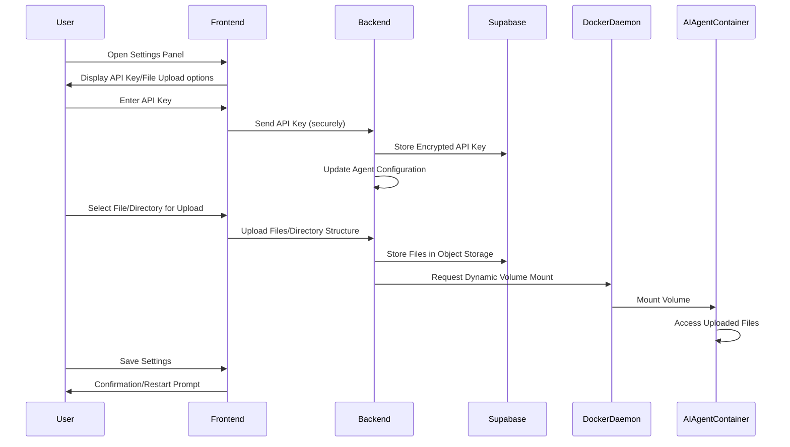

# Technical Architecture Analysis and Proposed Enhancements for Tubby

## 1. Introduction
This document provides a detailed analysis of the existing technical architecture of the Tubby AI Agent Communication Platform and outlines proposed enhancements to integrate new functionalities as requested by the user. The goal is to create a robust, scalable, and user-friendly platform that supports advanced AI agent interactions, collaborative development, and intuitive control mechanisms.

## 2. Current Architecture Overview
Based on the analysis of the Tubby GitHub repository and its accompanying documentation, the current platform is designed as a web-based application facilitating real-time communication with AI agents (Claude Code and Gemini CLI) within a Dockerized environment. The core components and their interactions are as follows:

### 2.1. Component Breakdown

#### 2.1.1. Frontend (Web Interface)
- **Technology Stack**: Primarily HTML and JavaScript, with `App.jsx` suggesting a React component for the main application interface. The `TechProductDocument_AIAgentCommunicationPlatform.md` confirms React.js, Tailwind CSS, and `xterm.js` for terminal emulation.
- **Functionality**: Provides a multi-terminal interface for interacting with Claude Code, Gemini CLI, and a system terminal. It displays real-time output from the agents and allows users to input commands.
- **Communication**: Establishes WebSocket connections to the Flask backend for sending commands and receiving real-time terminal output.

#### 2.1.2. Backend (Flask Application)
- **Technology Stack**: Python with Flask, utilizing Flask-SocketIO for WebSocket support. It interacts with Docker containers via the Docker SDK for Python.
- **Functionality**: Acts as an intermediary between the frontend and the AI agent containers. It receives commands from the web interface, forwards them to the appropriate agent, captures their output, and streams it back to the frontend.
- **Data Management**: Uses Redis for session management and caching. SQLite is mentioned for storing session data, command history, and user preferences.
- **API Key Management**: Securely handles API keys for various AI services (Google, Anthropic, Supabase, OpenAI) through environment variables.

#### 2.1.3. AI Agent Containers
- **Claude Code Container**: Runs Claude Code CLI, built on an Ubuntu-based Node.js image. It is designed to expose a port for Model Context Protocol (MCP) communication.
- **Gemini CLI Container**: Runs Gemini CLI, also built on an Ubuntu-based Node.js image. It is intended to connect to a central MCP server or directly to the Claude Code container via MCP.

#### 2.1.4. Redis Container
- **Functionality**: Used for session management and caching, facilitating real-time communication and state persistence within the application.

### 2.2. Communication Flow
The current communication flow, as described in the `TechProductDocument_AIAgentCommunicationPlatform.md`, involves:
1.  **User Input**: Commands are sent from the web interface (frontend).
2.  **Backend Processing**: The Flask backend receives these commands via WebSocket.
3.  **Agent Interaction**: The backend translates the commands and sends them to the target AI agent's Docker container.
4.  **Output Capture**: The AI agent processes the command, and its output is captured.
5.  **Real-time Display**: The output is streamed back to the web interface via WebSocket for real-time display in the respective terminal window.

### 2.3. Dockerization and Networking
- The platform leverages Docker for containerization, ensuring portability, isolation, and ease of deployment for each component.
- A custom Docker network is used for secure and isolated communication between containers.
- Internal ports are exposed for MCP communication and WebSocket connections.

## 3. Proposed Enhancements and Integration
This section details the integration of the requested new features into the existing architecture, outlining the necessary modifications and additions.

### 3.1. Smart Parser for User Interface

#### 3.1.1. Objective
To smooth out the user interface by intelligently parsing user input, enabling more natural and flexible command entry beyond strict CLI syntax. This parser will interpret user intent and translate it into appropriate commands for the AI agents or system.

#### 3.1.2. Architectural Integration
- **Frontend**: The smart parser will primarily reside in the frontend to provide immediate feedback and a more responsive user experience. It will preprocess user input before sending it to the backend.
- **Backend**: A more robust parsing and validation layer will be added to the backend to handle complex commands, context, and potential ambiguities. This layer will interact with the MCP service to construct appropriate messages for the AI agents.
- **AI Agent Interaction**: The parser will be designed to understand commands relevant to both Claude Code and Gemini CLI, allowing users to interact with them more conversationally.

#### 3.1.3. Implementation Details
- **Natural Language Processing (NLP)**: Implement a lightweight NLP library (e.g., `compromise` or a custom-trained model) in the frontend to identify entities, intents, and keywords from user input.
- **Command Mapping**: Develop a mapping system that translates parsed natural language into structured commands or MCP messages. This could involve a rule-based system or a machine learning model.
- **Context Awareness**: The parser will maintain context of the current terminal session, allowing for follow-up questions or commands that refer to previous interactions.
- **Feedback Mechanism**: Provide real-time visual feedback to the user as their input is being parsed and interpreted, suggesting corrections or alternative commands.

### 3.2. Whisper Voice Commands

#### 3.2.1. Objective
To enable hands-free operation and enhance accessibility by integrating OpenAI's Whisper for voice command recognition, allowing users to control the platform and interact with AI agents using spoken language.

#### 3.2.2. Architectural Integration
- **Frontend (Client-Side)**: For real-time, low-latency transcription of simple commands, Whisper.js will be integrated directly into the web interface. This will handle basic navigation and execution commands locally.
- **Backend (Server-Side)**: For more complex or longer voice inputs, the audio will be sent to the Flask backend, which will then utilize the OpenAI Whisper API (or a dedicated Whisper service container) for transcription. This provides a robust fallback and handles scenarios requiring higher accuracy or more computational power.
- **Command Processing**: The transcribed text from Whisper will be fed into the smart parser (Section 3.1) for intent recognition and command execution.

#### 3.2.3. Implementation Details
- **Audio Capture**: Implement browser-based audio recording capabilities (e.g., using `MediaRecorder API`).
- **Whisper.js Integration**: Integrate the Whisper.js library for client-side transcription. This will require careful management of audio streams and processing.
- **OpenAI Whisper API Integration**: Develop a backend service (or extend an existing one) to handle audio uploads, call the OpenAI Whisper API, and return transcriptions.
- **Voice Command Categories**: Define a comprehensive set of voice commands for navigation, execution, AI agent interaction, and system control (as detailed in the `TechProductDocument_AIAgentCommunicationPlatform.md`).
- **Privacy and Security**: Ensure user consent for audio recording, encrypt data in transit, and implement clear data retention policies.

### 3.3. Refined Settings Panel to Accept User Variables (API Keys) and File Directory Uploads

#### 3.3.1. Objective
To enhance user control and collaboration by refining the settings panel to allow users to easily manage their API keys and upload file directories for use by the AI agents.

#### 3.3.2. Architectural Integration
- **Frontend**: The settings panel UI will be redesigned to include intuitive forms for entering API keys and a file/directory upload interface. This will involve new React components and state management.
- **Backend**: The Flask backend will be extended to securely receive, validate, and store user-provided API keys and manage file uploads. This will involve integration with Supabase for persistent storage.
- **Supabase Integration**: Supabase will be crucial for securely storing user-specific API keys and managing file storage. Row-level security (RLS) will ensure data isolation between users.
- **Docker Volume Mounting**: For file directory uploads, the backend will need to dynamically configure Docker volume mounts for the AI agent containers, allowing them to access the uploaded files.

#### 3.3.3. Implementation Details
- **API Key Management**: Implement secure storage of API keys in Supabase, potentially encrypted at rest. The backend will retrieve these keys and inject them as environment variables into the respective AI agent containers at runtime.
- **File Upload Interface**: Utilize a robust file upload library in the frontend (e.g., `react-dropzone`) to handle single file and directory uploads. The backend will receive these files and store them in Supabase Storage.
- **Directory Structure Preservation**: When uploading directories, the backend must preserve the original directory structure within Supabase Storage and subsequently when mounting to Docker containers.
- **Dynamic Volume Mounting**: Develop a mechanism in the backend to update `docker-compose.yml` or directly interact with the Docker daemon to create and manage volumes that map uploaded directories to paths accessible by the AI agent containers.
- **User Permissions**: Implement granular permissions for file access, ensuring that agents only access files authorized by the user.

### 3.4. Collaborative Development Between Gemini Agents via `npm install -g @google/gemini-cli` in Docker Container with MCP Protocol

#### 3.4.1. Objective
To enable collaborative development workflows where multiple Gemini agents (and potentially other AI agents) can interact and share context, facilitated by the MCP protocol and the ability to access shared file directories.

#### 3.4.2. Architectural Integration
- **Gemini CLI Container**: The existing Gemini CLI container will be enhanced to fully support MCP as both a client and a server, allowing it to communicate with other agents and a central MCP router.
- **MCP Router Service**: A dedicated MCP router service (as outlined in the `TechProductDocument_AIAgentCommunicationPlatform.md`'s updated architecture diagram) will be implemented. This service will orchestrate communication between multiple AI agents, ensuring proper message routing and context sharing.
- **Shared File System**: The file directory upload feature (Section 3.3) will provide the shared workspace for collaborative agents. The MCP protocol can be extended to include messages for file system events or direct file access requests.

#### 3.4.3. Implementation Details
- **Enhanced Gemini CLI Container**: Ensure the Gemini CLI container is configured to run `npm install -g @google/gemini-cli` and expose its MCP capabilities. This might involve modifying the `Dockerfile` and entrypoint script.
- **MCP Router Implementation**: Develop the MCP router service, responsible for:
    - **Agent Registration**: Allowing AI agents to register themselves with the router.
    - **Message Forwarding**: Routing MCP messages between registered agents based on their IDs or capabilities.
    - **Context Management**: Potentially maintaining shared context or state for collaborative sessions.
- **Collaborative Protocol Extensions**: Define custom MCP messages or extensions to facilitate collaborative tasks, such as:
    - `mcp.file.read(path)`: Request to read a file from the shared directory.
    - `mcp.file.write(path, content)`: Request to write content to a file.
    - `mcp.agent.handover(task_description)`: Handover a task to another agent.
    - `mcp.agent.status()`: Query the status or capabilities of other agents.
- **Frontend Orchestration**: The frontend will provide the UI for initiating collaborative sessions, assigning tasks to different agents, and visualizing their interactions within the shared workspace.

## 4. Architecture Diagrams

### 4.1. High-Level System Architecture

```mermaid
graph TD
    A[User Interface] -->|WebSocket/REST| B(Flask Backend)
    B -->|Docker SDK/MCP| C[AI Agent Containers]
    C -->|File System Access| D[Shared Storage (Supabase)]
    B -->|Redis Commands| E[Redis Cache]
    B -->|Supabase API| D
    A -->|Voice Input| F[Whisper Service]
    F -->|Text Output| B
    C -->|MCP| C
```

### 4.2. Detailed Communication Flow for Collaborative Agents

```mermaid
sequenceDiagram
    participant User
    participant Frontend
    participant Backend
    participant MCPRouter
    participant GeminiAgent1
    participant GeminiAgent2
    participant SharedStorage

    User->>Frontend: Upload file directory
    Frontend->>Backend: Send files via API
    Backend->>SharedStorage: Store files
    Backend->>Backend: Configure Docker volumes for agents

    User->>Frontend: Initiate collaborative task (e.g., 


Collaborative Code Refactoring')
    Frontend->>Backend: Send collaborative task request
    Backend->>MCPRouter: Register agents for collaboration
    MCPRouter->>GeminiAgent1: Assign initial task (e.g., 'Analyze code in /shared/project')
    GeminiAgent1->>SharedStorage: Read code files
    GeminiAgent1->>MCPRouter: Send analysis results
    MCPRouter->>GeminiAgent2: Assign follow-up task (e.g., 'Refactor function X based on analysis')
    GeminiAgent2->>SharedStorage: Read/Write refactored code
    GeminiAgent2->>MCPRouter: Send refactoring progress/results
    MCPRouter->>Backend: Forward agent updates
    Backend->>Frontend: Display updates to User
    Frontend->>User: Display refactored code and progress
```

### 4.3. Settings Panel and File Upload Workflow



## 5. Next Steps for the Development Team
Based on the proposed enhancements and the existing architecture, the following are the recommended next steps for the development team:

### 5.1. Phase 1: Core Infrastructure & Foundational Enhancements (Weeks 1-4)
- **Refine Frontend Architecture**: Implement the smart parser for user input, focusing on basic intent recognition and command translation. Integrate Whisper.js for client-side voice command transcription.
- **Backend API & Supabase Integration**: Extend the Flask backend to handle secure API key storage in Supabase. Develop file upload endpoints and integrate with Supabase Object Storage. Implement dynamic Docker volume mounting based on user uploads.
- **MCP Router MVP**: Develop a minimal viable MCP router service to facilitate basic communication between two Gemini agents. Focus on agent registration and message forwarding.
- **Settings Panel UI**: Design and implement the initial UI for the settings panel, allowing users to input API keys and trigger file/directory uploads.

### 5.2. Phase 2: Advanced Features & Collaborative Workflows (Weeks 5-8)
- **Enhance Smart Parser**: Improve the smart parser with more sophisticated NLP capabilities, context awareness, and auto-completion for AI agent commands.
- **Server-Side Whisper Integration**: Implement the backend service for OpenAI Whisper API integration to handle complex voice commands and provide a robust fallback.
- **Collaborative MCP Extensions**: Define and implement custom MCP messages for collaborative development, including file read/write requests and agent handover protocols. Enhance the MCP router to manage collaborative sessions.
- **Refine Settings Panel Functionality**: Implement the full functionality for API key management (encryption, injection into containers) and robust file/directory upload with structure preservation.

### 5.3. Phase 3: UI/UX Polish & Performance Optimization (Weeks 9-12)
- **True Black Dark Mode**: Implement the comprehensive true black dark mode as specified in the `TechProductDocument_AIAgentCommunicationPlatform.md`, ensuring WCAG 2.1 AA compliance.
- **Advanced Terminal Features**: Integrate advanced `xterm.js` features such as tabs, split panes, search, and customizable appearance options. Implement session persistence.
- **Performance Optimization**: Focus on frontend rendering optimization (virtual scrolling, canvas rendering) and backend scalability (connection pooling, message batching, caching).
- **User Feedback & Iteration**: Conduct user testing sessions to gather feedback on the new features and iterate on the design and functionality.

### 5.4. Phase 4: Security, Testing & Deployment (Weeks 13-16)
- **Security Hardening**: Implement comprehensive authentication and authorization mechanisms (Google OAuth 2.0, JWT). Conduct security audits and penetration testing.
- **Automated Testing**: Develop robust unit, integration, and end-to-end tests for all new features, especially for the smart parser, voice commands, and collaborative workflows.
- **CI/CD Pipeline**: Establish automated CI/CD pipelines for continuous integration and deployment to staging and production environments.
- **Documentation**: Create detailed technical and user documentation for all new features, including API specifications, deployment guides, and user tutorials.

## 6. Conclusion
The proposed enhancements will transform the Tubby platform into a powerful and intuitive environment for AI-assisted development. By integrating a smart parser, Whisper voice commands, a refined settings panel, and robust collaborative features via the MCP protocol, the platform will significantly improve developer productivity and user experience. The outlined roadmap provides a clear path for the development team to achieve these objectives.


## 7. Development Roadmap and Feature Specification

This section details the phased development roadmap, specifying the features to be implemented in each stage, aligned with the user's requests and the technical analysis.

### 7.1. Phase 1: Core Infrastructure & Foundational Enhancements (Weeks 1-4)

**Goal**: Establish the fundamental infrastructure and implement core enhancements to support dynamic command processing, secure API key management, and initial MCP communication.

#### 7.1.1. Feature: Dynamic Command Processing and Smart Parser (Frontend MVP)
- **Description**: Implement a basic smart parser in the frontend to interpret user input in a more natural language format. This will allow users to type commands like "run claude code 'print('hello')'" instead of strict CLI syntax. The parser will identify the target AI agent and the command to be executed.
- **User Value**: Smoother user interface, reduced learning curve for interacting with AI agents.
- **Technical Specification**:
    - **Frontend**: Integrate a lightweight JavaScript-based NLP library (e.g., `compromise.js` or a custom regex-based parser) to identify keywords (`claude`, `gemini`, `system`), command types (`run`, `ask`, `generate`), and arguments.
    - **Input Field**: Enhance the terminal input field to provide real-time parsing feedback (e.g., highlighting recognized commands or suggesting corrections).
    - **Output**: Translate parsed input into a structured format (e.g., JSON object) that the backend can easily consume.

#### 7.1.2. Feature: Secure API Key Management (Backend & Supabase Integration)
- **Description**: Develop a secure mechanism for users to input and manage their API keys (Google, Anthropic, OpenAI, etc.) through the settings panel. These keys will be stored securely in Supabase and dynamically injected into the respective Docker containers at runtime.
- **User Value**: Centralized and secure management of API keys, eliminating the need for manual `.env` file configuration.
- **Technical Specification**:
    - **Frontend (Settings Panel)**: Create a dedicated section in the settings UI with input fields for various API keys. Implement client-side validation for key formats.
    - **Backend (API Endpoints)**: Develop secure REST API endpoints for receiving, encrypting, and storing API keys in Supabase. Use a robust encryption method (e.g., AES-256) for data at rest.
    - **Supabase Schema**: Extend the `user_preferences` table or create a new `api_keys` table to store encrypted API keys associated with user IDs.
    - **Dynamic Injection**: Modify the Docker container startup scripts or the Flask backend's container management logic to retrieve encrypted API keys from Supabase, decrypt them, and pass them as environment variables to the AI agent containers before they start or when a new session is initiated.

#### 7.1.3. Feature: Initial File Directory Uploads (Backend & Supabase Storage)
- **Description**: Enable users to upload local file directories to the platform. These directories will be stored in Supabase Object Storage and made accessible to the AI agent containers via dynamic Docker volume mounts, facilitating collaborative development.
- **User Value**: Ability to share codebases and project files with AI agents for analysis, refactoring, and collaborative coding tasks.
- **Technical Specification**:
    - **Frontend (Settings Panel)**: Implement a file/directory upload component (e.g., using `react-dropzone` for drag-and-drop functionality) that can handle recursive directory uploads.
    - **Backend (Upload Service)**: Develop a backend service to receive uploaded files and directories. This service will reconstruct the directory structure and store individual files in Supabase Object Storage.
    - **Supabase Object Storage**: Utilize Supabase Storage buckets to store user-uploaded files. Implement appropriate access control policies (RLS) to ensure data privacy.
    - **Dynamic Docker Volume Mounting**: Develop a mechanism to dynamically create and manage Docker volumes. When a user uploads a directory, the backend will instruct the Docker daemon to mount this directory (or a representation of it from Supabase) into the AI agent containers at a predefined path (e.g., `/shared/user_projects/`). This might involve modifying `docker-compose.yml` on the fly or using the Docker SDK directly.

#### 7.1.4. Feature: Basic MCP Router MVP
- **Description**: Implement a minimal viable MCP router service to enable basic communication between two Gemini agents. This router will handle agent registration and simple message forwarding.
- **User Value**: Foundation for collaborative AI agent workflows and inter-agent communication.
- **Technical Specification**:
    - **MCP Router Service**: Develop a standalone Python service (or integrate into the Flask backend initially) that implements the core MCP routing logic. This service will listen on a dedicated port (e.g., 8080).
    - **Agent Registration**: Implement an MCP endpoint for AI agents to register themselves with the router, providing their unique ID and capabilities.
    - **Message Forwarding**: The router will receive MCP messages from one agent and forward them to the designated recipient agent based on the message's `to` field.
    - **Docker Integration**: Ensure the MCP router service is containerized and accessible from the AI agent containers within the Docker network.

### 7.2. Phase 2: Advanced Features & Collaborative Workflows (Weeks 5-8)

**Goal**: Enhance the smart parser and voice command system, implement advanced collaborative features via MCP, and refine the settings panel functionality.

#### 7.2.1. Feature: Enhanced Smart Parser with Context Awareness
- **Description**: Improve the smart parser to understand more complex natural language commands, including contextual references (e.g., "refactor *this function*", "explain *the selected code block*"). It will also provide more intelligent auto-completion suggestions.
- **User Value**: Highly intuitive and efficient command entry, reducing the need for precise syntax.
- **Technical Specification**:
    - **NLP Model**: Upgrade the frontend NLP capabilities to handle more sophisticated intent recognition and entity extraction. Consider using a pre-trained model or fine-tuning a smaller model for code-related contexts.
    - **Context Management**: Implement a context store in the frontend that tracks the active terminal, selected code, previous commands, and agent responses. The parser will leverage this context to interpret ambiguous commands.
    - **Auto-completion**: Develop a dynamic auto-completion system that suggests commands, parameters, and even code snippets based on the current context and the AI agent's capabilities.

#### 7.2.2. Feature: Server-Side Whisper Integration for Complex Voice Commands
- **Description**: Implement the backend service for OpenAI Whisper API integration to handle longer and more complex voice commands. This will serve as a robust fallback for client-side Whisper.js and enable more nuanced voice interactions.
- **User Value**: Reliable voice command functionality for all types of commands, including multi-line prompts and detailed instructions.
- **Technical Specification**:
    - **Backend Endpoint**: Create a dedicated backend endpoint to receive audio streams from the frontend. This endpoint will then call the OpenAI Whisper API for transcription.
    - **Audio Preprocessing**: Implement audio preprocessing steps (e.g., noise reduction, silence trimming) on the backend to optimize transcription accuracy.
    - **Error Handling**: Implement robust error handling for API calls, including retries and informative error messages to the user.
    - **Integration with Smart Parser**: The transcribed text from the server-side Whisper will be fed into the enhanced smart parser for command interpretation and execution.

#### 7.2.3. Feature: Collaborative MCP Extensions
- **Description**: Extend the MCP protocol and the MCP router to support advanced collaborative development features. This includes defining custom MCP messages for file operations (read, write, list), agent handover, and status queries.
- **User Value**: Seamless collaboration between multiple AI agents on shared projects, enabling complex workflows like code review, refactoring, and debugging.
- **Technical Specification**:
    - **MCP Message Definitions**: Define new MCP message types and schemas for collaborative actions (e.g., `mcp.file.read`, `mcp.file.write`, `mcp.agent.handover`, `mcp.agent.status`). These will be based on the MCP specification's extensibility.
    - **MCP Router Enhancements**: The MCP router will be updated to understand and route these new collaborative messages. It will also manage shared session contexts for collaborative tasks.
    - **AI Agent Integration**: Modify the Gemini CLI (and potentially Claude Code) containers to implement the client-side logic for these new MCP messages, allowing them to send and receive collaborative commands.
    - **Frontend Orchestration**: Develop UI components to initiate and manage collaborative sessions, visualize agent interactions, and display shared file system changes in real-time.

#### 7.2.4. Feature: Refined Settings Panel Functionality
- **Description**: Fully implement the functionality for API key management, including encryption at rest and dynamic injection into containers. Enhance file/directory upload with progress indicators, error handling, and robust directory structure preservation.
- **User Value**: Complete control over personal settings and project files, with a smooth and reliable user experience.
- **Technical Specification**:
    - **API Key Encryption**: Ensure API keys are encrypted before storage in Supabase and decrypted only when needed for injection into containers. Implement key rotation mechanisms.
    - **Container Injection**: Develop a robust and secure method to inject API keys as environment variables into running or newly created Docker containers, ensuring they are not exposed in logs or process lists.
    - **File Upload Reliability**: Implement chunked uploads for large files, progress bars, and resumable uploads. Add comprehensive error handling and retry mechanisms.
    - **Directory Structure Preservation**: Ensure that the uploaded directory structure is perfectly replicated in Supabase Storage and accurately mounted as Docker volumes, maintaining file paths for AI agents.
    - **User Feedback**: Provide clear visual feedback on upload progress, success, and any errors.

### 7.3. Phase 3: UI/UX Polish & Performance Optimization (Weeks 9-12)

**Goal**: Achieve a highly polished user interface, implement advanced terminal features, and optimize overall platform performance.

#### 7.3.1. Feature: True Black Dark Mode with Customization
- **Description**: Implement a comprehensive true black dark mode (`#000000` background) across the entire application, ensuring optimal contrast and reduced eye strain. Provide customization options for accent colors and typography.
- **User Value**: A visually appealing and comfortable user experience, especially for extended coding sessions.
- **Technical Specification**:
    - **CSS Variables/Theming**: Utilize CSS variables for color management to allow for easy theme switching and customization. Implement a theme provider in React.
    - **WCAG 2.1 AA Compliance**: Ensure all color combinations meet or exceed WCAG 2.1 AA contrast ratio guidelines for accessibility.
    - **Customization UI**: Develop a dedicated section in the settings panel for theme customization, allowing users to select primary, secondary, and accent colors, as well as font styles and sizes.
    - **Per-Terminal Themes**: Optionally, allow users to apply different themes to individual terminal panels.

#### 7.3.2. Feature: Advanced Terminal Features
- **Description**: Integrate advanced features into the `xterm.js` terminals, including tab support, split panes, in-terminal search, and customizable appearance (fonts, cursor styles).
- **User Value**: A powerful and flexible terminal environment that mimics professional IDEs and command-line tools.
- **Technical Specification**:
    - **xterm.js Extensions**: Implement relevant `xterm.js` add-ons for features like `fit`, `webgl`, `search`, and `unicode11`.
    - **Tab Management**: Develop UI components for creating, switching, and closing terminal tabs within each panel.
    - **Split Panes**: Implement functionality to split terminal panels horizontally or vertically, allowing users to view multiple outputs simultaneously.
    - **Search and Highlight**: Integrate in-terminal search with regex support and highlight matching text.
    - **Customization**: Expose `xterm.js` configuration options in the settings panel for font selection, font size, line height, and cursor styles.

#### 7.3.3. Feature: Performance Optimization
- **Description**: Optimize both frontend rendering and backend communication to ensure smooth performance even with multiple active terminals, large outputs, and high agent activity.
- **User Value**: A fast, responsive, and reliable platform that doesn't lag or consume excessive resources.
- **Technical Specification**:
    - **Frontend Rendering**: Implement virtual scrolling for large terminal buffers to render only visible lines. Utilize `requestAnimationFrame` for smooth updates and debouncing for terminal output to reduce CPU usage.
    - **WebSocket Optimization**: Implement WebSocket compression (e.g., `permessage-deflate`) and delta updates (sending only changed parts of the terminal screen) to minimize network traffic.
    - **Backend Caching**: Implement Redis-based caching for frequently accessed data (e.g., agent capabilities, common responses) to reduce database load and improve response times.
    - **Resource Monitoring**: Integrate backend metrics collection (CPU, memory, network I/O) and display them in the frontend to help users understand resource consumption.

### 7.4. Phase 4: Security, Testing & Deployment (Weeks 13-16)

**Goal**: Ensure the platform is secure, thoroughly tested, and ready for production deployment.

#### 7.4.1. Feature: Comprehensive Authentication and Authorization
- **Description**: Implement robust user authentication using Google OAuth 2.0 and role-based access control (RBAC) to manage user permissions and access to features.
- **User Value**: Secure access to the platform, protecting user data and preventing unauthorized use.
- **Technical Specification**:
    - **Google OAuth 2.0**: Integrate Google OAuth 2.0 with PKCE flow for secure user login. Manage JWT tokens for session persistence and automatic refresh.
    - **RBAC**: Define roles (e.g., `individual`, `team_admin`, `enterprise_user`) and assign permissions to features (e.g., file uploads, collaborative sessions, advanced settings).
    - **Supabase Integration**: Utilize Supabase's built-in authentication and Row-Level Security (RLS) to enforce data access policies based on user roles and IDs.
    - **Audit Logging**: Implement comprehensive audit logging of all user actions and system events for security monitoring and compliance.

#### 7.4.2. Feature: Automated Testing Suite
- **Description**: Develop a comprehensive suite of automated tests, including unit, integration, and end-to-end tests, to ensure the reliability, functionality, and performance of all new and existing features.
- **User Value**: A stable and bug-free platform, with new features delivered confidently.
- **Technical Specification**:
    - **Unit Tests**: Write unit tests for all frontend components (React, smart parser, voice command logic) using Jest and React Testing Library. For the backend, use `pytest` for Flask services, MCP router, and file management.
    - **Integration Tests**: Develop integration tests to verify communication between frontend and backend (WebSockets, REST APIs), backend and Docker containers, and inter-agent MCP communication.
    - **End-to-End Tests**: Use Playwright or Cypress for end-to-end testing of critical user workflows, including login, command execution, file uploads, and collaborative sessions.
    - **Performance Tests**: Implement load testing for the backend and stress testing for the voice command system to identify performance bottlenecks.

#### 7.4.3. Feature: CI/CD Pipeline & Production Deployment Readiness
- **Description**: Establish automated Continuous Integration (CI) and Continuous Deployment (CD) pipelines to streamline development, ensure code quality, and enable rapid, reliable deployments to staging and production environments.
- **User Value**: Faster delivery of new features and bug fixes, with minimal downtime and high reliability.
- **Technical Specification**:
    - **CI Pipeline**: Configure a CI system (e.g., GitHub Actions, GitLab CI) to automatically run tests, code quality checks (ESLint, Black), and security scans (Snyk) on every code commit.
    - **Container Image Builds**: Automate the building and tagging of Docker images for all services (frontend, backend, AI agents, MCP router) within the CI pipeline.
    - **CD Pipeline**: Implement a CD pipeline for automated deployment to a staging environment upon successful CI. For production, consider a blue-green deployment strategy or similar for zero-downtime updates.
    - **Monitoring & Alerting**: Integrate monitoring tools (e.g., Prometheus, Grafana) and alerting systems to track application health, performance, and resource utilization in production.
    - **Documentation**: Create comprehensive deployment guides, runbooks, and troubleshooting documentation for production environments.

## 8. Feature Prioritization and Iteration Strategy

The roadmap is designed with an iterative approach, prioritizing foundational elements and user-facing features that deliver immediate value. Subsequent phases build upon these foundations, adding complexity and advanced capabilities.

### 8.1. Prioritization Principles
- **User Impact**: Features that directly address user pain points or significantly enhance the core user experience are prioritized.
- **Technical Dependency**: Foundational features that other functionalities rely on are implemented first.
- **Risk Mitigation**: Features that address critical security or performance risks are given high priority.
- **Iterative Delivery**: Break down large features into smaller, manageable increments for continuous delivery and feedback.

### 8.2. Iteration Strategy
- **MVP (Minimum Viable Product)**: Focus on delivering the core multi-terminal interface with basic dynamic command processing, secure API key management, and initial MCP communication.
- **Alpha Release**: Introduce voice commands, file directory uploads, and enhanced smart parsing to a small group of early adopters for feedback.
- **Beta Release**: Refine all features based on alpha feedback, implement advanced terminal features, and optimize performance. Expand to a larger beta user base.
- **General Availability (GA)**: Release the fully polished, secure, and performant platform with all planned features. Continue to iterate based on ongoing user feedback and market demands.

This roadmap provides a clear, actionable plan for the development team to transform the Tubby platform into a leading AI agent communication and collaboration tool. Each phase is designed to deliver tangible value and build a solid foundation for future enhancements.

